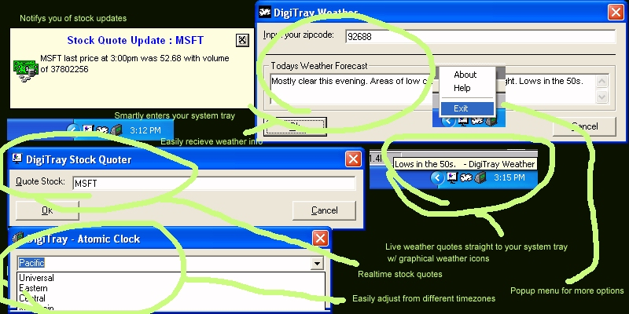



## DigiTray Updated

### Description

You have probably seen all of those programs like syncronize or date time enhancer. Well here is a similar program made in vb6, w/ PROFESSIONAL WEATHER FORECAST, REALTIME STOCK QUOTER, and ATOMIC TIME SYNCRONIZER. If i get enough votes i might release another version - so PLEASE vote.
 
### More Info
 

             |
---                |---
**Submitted On**   |2002-10-19 09:52:00
**By**             |[Dark Coder](https://github.com/Planet-Source-Code/PSCIndex/blob/master/ByAuthor/dark-coder.md)
**Level**          |Intermediate
**User Rating**    |4.8 (19 globes from 4 users)
**Compatibility**  |VB 5\.0, VB 6\.0
**Category**       |[Complete Applications](https://github.com/Planet-Source-Code/PSCIndex/blob/master/ByCategory/complete-applications__1-27.md)
**World**          |[Visual Basic](https://github.com/Planet-Source-Code/PSCIndex/blob/master/ByWorld/visual-basic.md)
**Archive File**   |[DigiTray\_U14879910272002\.zip](https://github.com/Planet-Source-Code/dark-coder-digitray-updated__1-40202/archive/master.zip)

